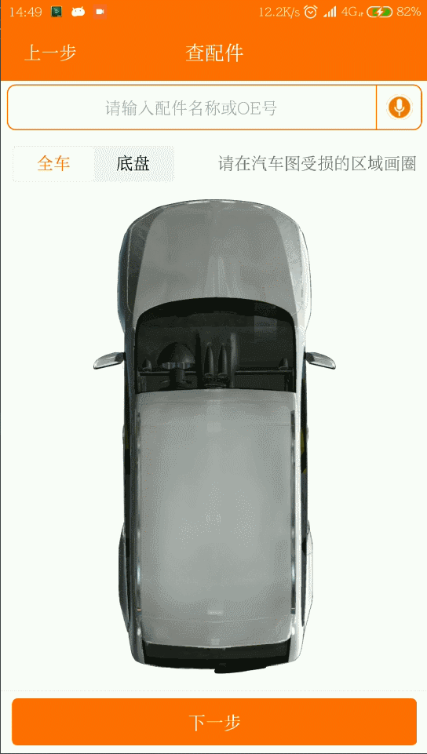
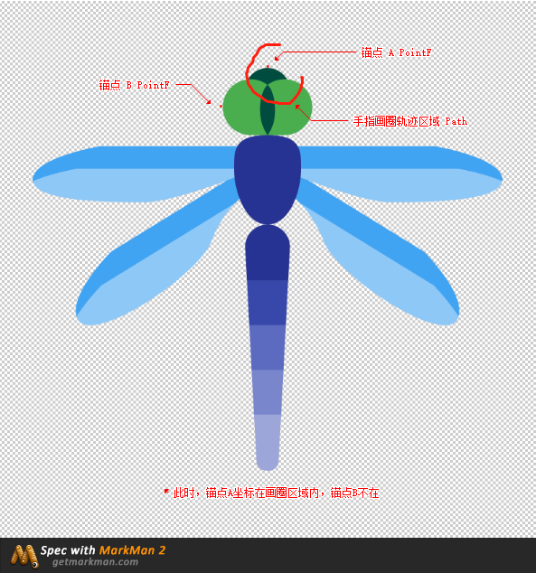
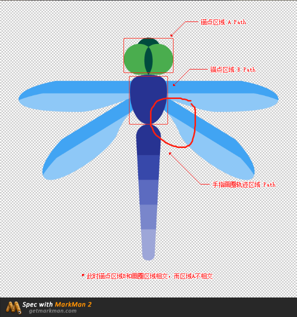

# 简介
对图片进行手指画圈定位

这是一个对特定场景的库，可能单单看简单的描述无法知道它的应用场景，这里举个例子你就能明白了。  
我见到这个应用场景是在公司合作的第三方平台提供的库里面，通过在车的模型图片上画圈，来获取画圈部位的车的配件名称列表，效果如下图：  

  

# 本库实现功能

翻看了下上面对车画圈定位的库，在一堆堆代码混淆中晕晕乎乎好久终于找到，找到后迎来的却是大失所望。内部实现方式完全没有拓展性，同时实现采用的逻辑
也使得定位十分初略（不精准）。于是决定自己动手，衣食都有！  

目前本库实现的功能有：  

* 模型图片的部件采用 **锚点** 和 **锚点区域** 两种方式；
* **锚点** 时，通过判断锚点坐标是否在手指画圈轨迹区域内来判定；
* **锚点区域** 时，通过判断锚点区域是否和手指画圈轨迹区域相交来判定；
* 锚点 和 锚点区域 的坐标测量，只需要根据在模型图片上的坐标位置设置就行，不需要考虑实际显示时图片大小；

判定方式图示：  

 