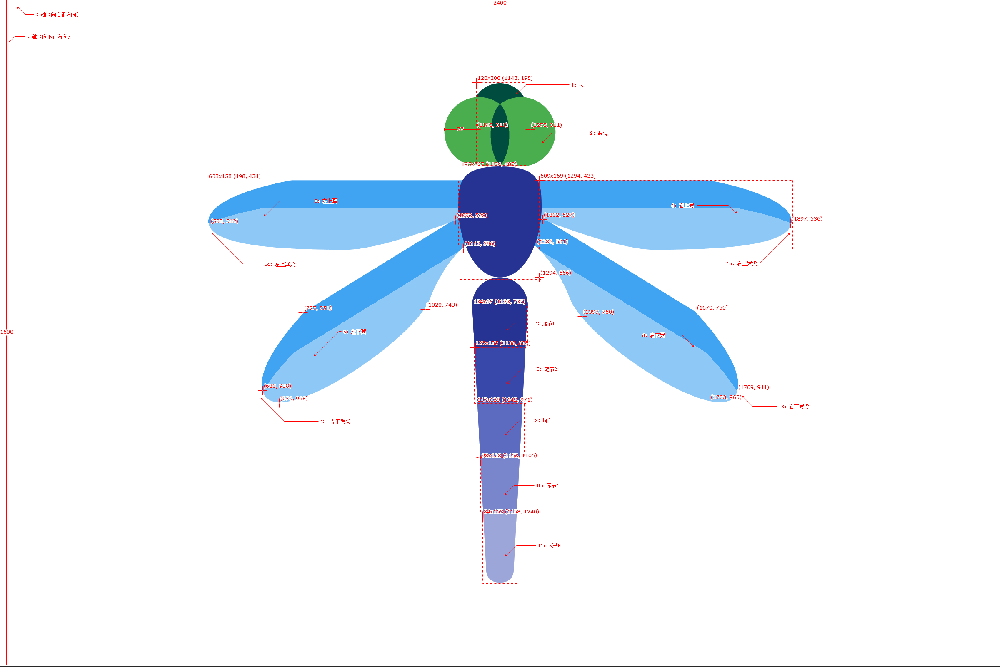

# 简介
对图片进行手指画圈定位

这是一个对特定场景的库，可能单单看简单的描述无法知道它的应用场景，这里举个例子你就能明白了。  
我见到这个应用场景是在公司合作的第三方平台提供的库里面，通过在车的模型图片上画圈，来获取画圈部位的车的配件名称列表，效果如下图：  

  

# 本库实现功能

翻看了下上面对车画圈定位的库，在一堆堆代码混淆中晕晕乎乎好久终于找到，找到后迎来的却是大失所望。内部实现方式完全没有拓展性，同时实现采用的逻辑
也使得定位十分初略（不精准）。于是决定自己动手，衣食都有！  

目前本库实现的功能有：  

* 模型图片的部件采用 **锚点** 和 **锚点区域** 两种方式；
* **锚点** 时，通过判断锚点坐标是否在手指画圈轨迹区域内来判定；
* **锚点区域** 时，通过判断锚点区域是否和手指画圈轨迹区域相交来判定；
* 锚点 和 锚点区域 的坐标测量，只需要根据在模型图片上的坐标位置设置就行，不需要考虑实际显示时图片大小；

判定方式图示：  

 

# 使用步骤

**1.** 准备模型图片和确定锚点坐标

确定你的模型图片，然后根据模型图片的 **宽px像素值为X轴、高px像素值为Y轴、模型图片的左上角为原点、向右和向下为正方向**，通过上述这个坐标系来
确定和测量各锚点坐标、各锚点区域关键点坐标。如下图：  

  
[查看大图](https://raw.githubusercontent.com/OCNYang/DrawPartViewDemo/master/README_Res/dragonflyw_spec.png)

上述蜻蜓图片的大小为（2400px*1600px），那就以此为坐标系来确定各锚点。这里我在测量坐标时使用的是 [马克鳗](http://www.getmarkman.com/) 这个工具，
如果想省力，直接把这一步交给美工就好了，哈哈~~~  

